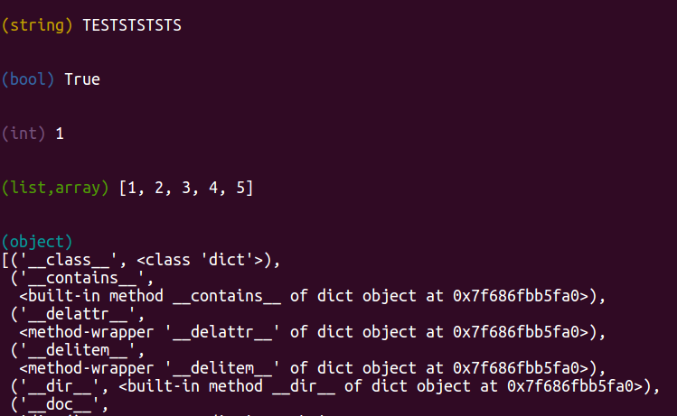
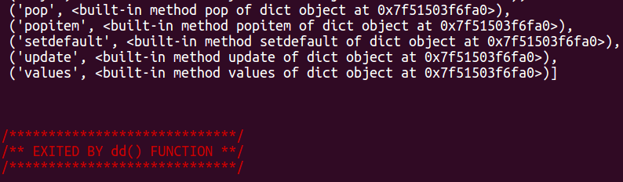

# SimpleDump for Python

This is a simple package which adds var_dump(), dd() and dump() functions for debugging Pythone code in PHP-style
[SimpleDump](https://github.com/udartsev/SimpleDump)

hen debugging in Python, ypu can frequently find it useful to simply stick a var_dump() in code to show what a variable is, what it`s value is, and the same for anything that it contains.

## Install
`pip install SimpleDump`

or update:

`pip install -U SimpleDump`

## Usage

```python
# test.py

from SimpleDump import var_dump, dd, dump`

test1 = "TESTSTSTSTS"
test2 = True
test3 = 1
test4 = [1, 2, 3, 4, 5]
test5 = {}

# use dump(), var_dump() for console output
# use dd() for console output and exit (dump + die)

dump(test1) # (string) TESTSTSTSTS
dump(test2) # (bool) True
dump(test3) # (int) 1
dump(test4) # (list,array) [1, 2, 3, 4, 5]
dd(test5) # (object) [('__class__', <class 'dict'>)....
```

## Output
 
 
##### Creating PIP package
```bash
python setup.py sdist bdist_wheel
python -m twine upload --repository-url https://upload.pypi.org/legacy/ dist/*
```

## License
MIT